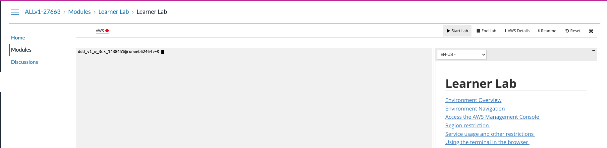
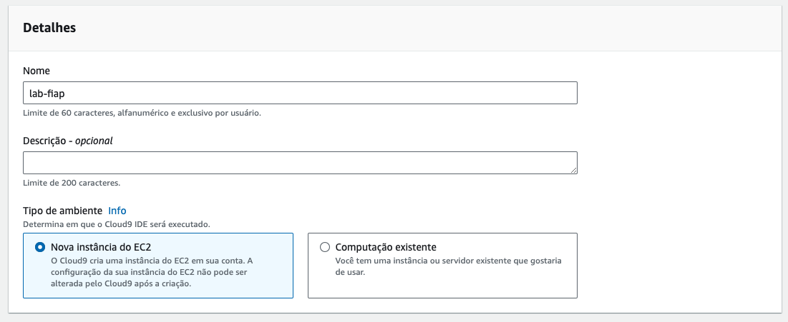
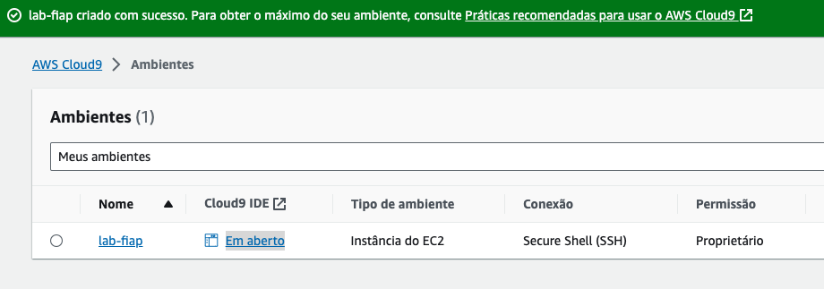

# 00 - Setup e Configuração de ambiente

Você irá utilizar 3 ferramentas para desenvolver os laboratorios:
1. Conta AWS através da AWS Academy. Conta provisionada para você utilizar durante essa disciplina com 100 dólares de crédito.
2. Postman instalado na sua maquina local para fazer as requisições das APIs que irá criar.
3. Cloud 9 IDE. Uma IDE cloud dentro da AWS para todos terem um ambeinte igual e com a autorização para executar os comandos dos exercicios.

### Conta AWS - Academy

1. Caso não tenha conta no AWS Academy ainda:
   1. Entre no seu email da FIAP pelo endereço [webmail.fiap.com.br](http://webmail.fiap.com.br/)
   2. Seu email é no seguinte formato rm + numero do seu RM + @fiap.com.br. Caso seu RM seja por exemplo 12345 seu email seria rm12345@fiap.com.br. A senha é a mesma de portais.
   3. Você terá um email na caixa de entrada para convite do Academy, siga as instruções.
   4. Ao conseguir entrar na plataforma do academy, aparecerá uma turma que começa com `AWS Academy Learner Lab`. Apenas clique em `Enroll` para aceitar e acessar.
2. Para entrar na conta do Academy que já existe, acesse o link:  [awsacademy.com/LMS_Login](https://www.awsacademy.com/LMS_Login)
3. Dentro da plataforma clique em `cursos` na lateral esquerda e clique no curso da disciplina atual.

4. Dentro do curso clique em `Modules` na lateral esquerda
   
   

5. Clique em `Lerner Lab` 
   
   

6. Se for seu primeiro acesso irá aparecer o contrato de termos e condições para aceitar. Role até o final para aceitar após a leitura do mesmo. Caso já tenha feito isso antes. Pule para o passo 7.
   
7. Essa é a tela para acessar sua conta AWS. Cada sessão terá 4 horas. Após esse tempo você terá que começar outra sessão, mas os dados gravados dentro da conta AWS ficam salvos até o final do curso ou entrega do trabalho final da disciplina. Clique em `Start Lab` para iniciar uma sessão. Esse processo pode demorar alguns minutos.
   
   
8. Quando tudo estiver pronto a bolinha ao lado do escrito `AWS` no superior esquerdo da tela ficará verde como na imagem abaixo. Apenas clique em `AWS` para abrir a conta aws em outra aba do navegador.

### Postman

1. Baixe e instale o Postman em seu computador utilizando o link: [Postman Download](https://www.postman.com/downloads/)

### Cloud 9
 1. Abra o console da AWS e va para o serviço `Cloud 9` através da barra de pesquisas.
   
1. garanta que a região que esta utilizando é `us-east-1/ Norte da Virgínia`. Você consegue ver isso no canto superior direiro da tela.
    
 2. Clique em `create environment`.
 3. Coloque o nome `lab-fiap` e avance.
 
 5. Deixe as configurações como na imagem a seguir. Se atente ao tipo da maquina que deve ser `t2.medium` e o sistema operacional `Ubuntu Server 18.04 LTS`:

 6. Caso os parametros estejam como na imagem a seguir clique em `Create Environment`
   
 7. A criação do ambiente pode levar alguns minutos.

 8. Após a criação clique em `abrir IDE`, caso o IDE não tenha aberto automaticamente.
   
9. Para os próximos comandos utilize o console bash que fica no canto inferior do seu IDE.
   
10. Execute o comando `npm install -g serverless` para instalar o serverless framework.
    
11. Execute o comando `sudo apt  install jq -y` para instalar o software que irá nos ajudar a ler e manipular Jsons no terminal. Caso esse comando de erro, aguarde 3 minutos para o sistema terminar a preparação inicial.
12. Execute o comando `npm install -g c9` para baixar a extenção que ajudará o Cloud9 a lidar melhor com o como abrir arquivos no IDE.
13. Execute o comando `git clone https://github.com/vamperst/fiap-gerenciamento-de-apis.git` para clonar o repositório com os exercicios.
14. Execute o comando `cd fiap-gerenciamento-de-apis/` para entrar na pasta criada pelo git
15. Execute o comando `cd 00-Setup-e-configuracao` para entrar na pasta com os scripts de Configuração.
16. Precisamos aumentar o tamanho do volume(HD) do cloud9. Para isso execute o comando  `sh resize.sh`
   
