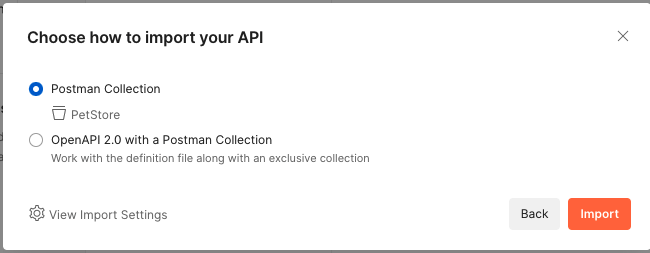

# 01 - Primeira API

OBJETIVO: Criar a primeira api no serviço [Amazon API Gateway](https://aws.amazon.com/pt/api-gateway/) utilizando a estrutura de exemplo do painel.

1. Abra o serviço [API Gateway](https://us-east-1.console.aws.amazon.com/apigateway/main/apis?region=us-east-1)
    
    

2. Desça nas opções da tela até `API REST` e clique em `importar`.
   
   

3. Leia e clique em OK na mensagem
   
   

4. No canto inferior direito da tela clique em `Importar`
5. Sua API ficará com a seguinte estrutura:
   
   

6. Faça testes antes de executar o deploy da API. Para isso vá em `POSTS` do `/pets/`.
   
   

7. Clique em `Teste`
8. No campo `Corpo de solicitação` cole o seguinte conteúdo:
   ``` json
   {"type": "dog", "price": 249.99}
   ```
    
9. Na parte inferior da tela clique em `Teste`. Você executou o teste dessa chamada da sua API. Você pode ver a resposta em `Corpo de resposta` e todos os logs da chamada em `Logs`
    
    

10. Agora sim é hora de implantar a API para ter uma URL a ser chamada. Para isso clique em `Ações` no superior esquerdo da tela e clique em `Implantar API`
    
    

11. Preencha os campos do formulário como na imagem abaixo:

    

12. Clique em `Implante`.
13. Pronto você criou sua primeira API no API Gateway e a URL para chamar esta no topo da tela.
14. Vamos executar chamadas de teste via POSTMAN para testar a API externamente. Clique na aba `Exportar` do récem criado estagio Test. Na opção `Exportar como Swagger + extensões do Postman` clique em `YAML` para baixar o arquivo de configuração do postman diretamento do api gateway.

    

15. Abra o Postman na sua maquina local. 
16. Dentro do Postman clique em `Import`.
    
    

17. Carregue o arquivo recem baixado do API Gateway. Após carregar o arquivo o postman ficará como na imagem abaixo:
    
    

18. Expanda os campos até chegar em `POST Create Pet` e clique para abrir no editor. Copie o json abaixo no corpo da requisição:
    ``` json
    {
    "type": "bird",
    "price": 234.98
    }
    ```
    
    

19. Clique em `Send` na lateral direita da tela. Você acabou de fazer uma chamada para sua API via postman.
    
    
20. Agora você fará uma chamada de listagem. Para isso clique em `Get /pets` para abrir no editor.

    

21. Edite o valor do campo `type` para `cat` e o valor do campo `page` para `1`.
    
    

22. Clique em `Send` no superior direito para executar a listagem.

    

23. Como ultimo teste, o path princial da sua API retorna um HTML quando chamada via médoto GET(Caso dos navegadores). Retorne ao API Gateway e copie a URL da sua API e cole no navegador.
    
    

    
