# 02 - HTTP-API

Nesse exercicio você vai criar um infra estrutura com uma [HTTP API do API Gateway](https://docs.aws.amazon.com/pt_br/apigateway/latest/developerguide/http-api-vs-rest.html) conectada a um backend [lambda](https://docs.aws.amazon.com/pt_br/lambda/latest/dg/welcome.html) e um banco de dados [dynamoDB](https://docs.aws.amazon.com/pt_br/amazondynamodb/latest/developerguide/Introduction.html)


1. Primeiro crie o dynamoDB. Para isso acesse o [console](https://console.aws.amazon.com/dynamodb/) e clique em `Criar tabela` no lado direito da tela.
   
   


2. Preencha o campos da seguinte maneira:
   1. Nome da tabela: `http-crud-tutorial-items`
   2. Chave de partição: `id`

    

3. Sem mais alterações clique em `Criar tabela` no final da página. 
4. Aguarde até a tabela ficar ativa como na imagem
   
   

5. Agora crie a função lambda que será utilizada na sua arquitetura. Entre no [console](https://console.aws.amazon.com/lambda) do lambda.
   
   

6. Clique em `Criar Função` no superior direito da tela.
7. Preencha os campos da seguinte maneira
   1. Nome da função: `http-crud-tutorial-function`
   2. Tempo de execução: `Node.js 16.x`
   3. Em Permissões, escolhe `Usar uma função existente` e selecione `LabRole`

    

8. Sem mais alterações clique em `Criar função` no final da página.
9. Note que no meio da tela tem um IDE em `Origem do código`. Na lateral desse IDE abra o arquivo `index.js` com um duplo clique.
10. Copie o código abaixo e cole no IDE do lambda.
```node
const AWS = require("aws-sdk");

const dynamo = new AWS.DynamoDB.DocumentClient();

exports.handler = async (event, context) => {
  let body;
  let statusCode = 200;
  const headers = {
    "Content-Type": "application/json"
  };

  try {
    switch (event.routeKey) {
      case "DELETE /items/{id}":
        await dynamo
          .delete({
            TableName: "http-crud-tutorial-items",
            Key: {
              id: event.pathParameters.id
            }
          })
          .promise();
        body = `Deleted item ${event.pathParameters.id}`;
        break;
      case "GET /items/{id}":
        body = await dynamo
          .get({
            TableName: "http-crud-tutorial-items",
            Key: {
              id: event.pathParameters.id
            }
          })
          .promise();
        break;
      case "GET /items":
        body = await dynamo.scan({ TableName: "http-crud-tutorial-items" }).promise();
        break;
      case "PUT /items":
        let requestJSON = JSON.parse(event.body);
        await dynamo
          .put({
            TableName: "http-crud-tutorial-items",
            Item: {
              id: requestJSON.id,
              price: requestJSON.price,
              name: requestJSON.name
            }
          })
          .promise();
        body = `Put item ${requestJSON.id}`;
        break;
      default:
        throw new Error(`Unsupported route: "${event.routeKey}"`);
    }
  } catch (err) {
    statusCode = 400;
    body = err.message;
  } finally {
    body = JSON.stringify(body);
  }

  return {
    statusCode,
    body,
    headers
  };
};

```


11. Clique em `Deploy` ao lado da tecla laranja de Test.
12. Hora de criar a API HTTP. Entre no [console](https://console.aws.amazon.com/apigateway) do API Gateway para isso.
13. Clique em `Criar API`
14. Em `API HTTP` clique em `Compilar`
    
    

15. No nome da api coloque `http-crud-tutorial-api` e clique em Avançar.
    
    

16. As rotas serão criadas posteriormente então na pagina de configuração de rotas apenas clique em `Avançar`
    
    

17. Em `Definir estágios` clique em `Avançar`
18. Revise e clique em `Criar`
    
    
    

19. Agora você irá criar as 4 rotas dessa API. Para isso na API recém criada clique em `Rotas` na lateral esquerda.

    

20. Clique em `Create`
21. No método selecione `GET` e na rota digite `/items/{id}` e clique em criar.

    

22. Repita os passos 2 ultimos passos mais 3 vezes com os seguintes valores:
    1. Método: `GET` path: `/items`
    2. Método: `DELETE` path: `/items/{id}`
    3. Método: `PUT` path: `/items`


    

23. Com as rotas prontas é necessário fazer a integração com o lambda que criou anteriormente. Para isso clique em `Integrações` na lateral esquerda da página e então selecione a aba `Gerenciar integrações`.


24. Clique em `Create`
25. Selecione os seguintes valores no formulário e clique em criar no final da página:
    1. Anexar essa integração a uma rota: `GET /items/{id}`
    2. Destino da integração: `Função do Lambda`
    3. Função do Lambda: `http-crud-tutorial-function`


26. Repita o passo anterior mais 3 vezes alterando a rota alvo por:
    1. PUT /items
    2. GET /items
    3. DELETE /items/{id}

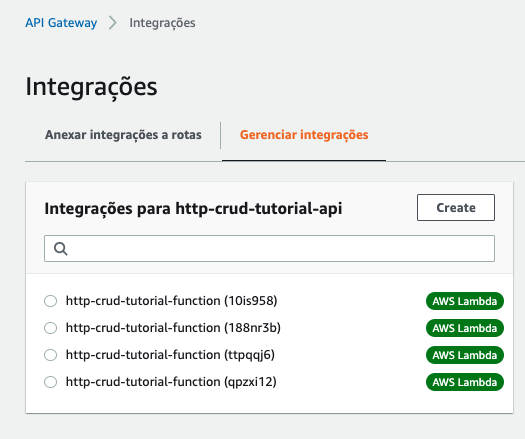

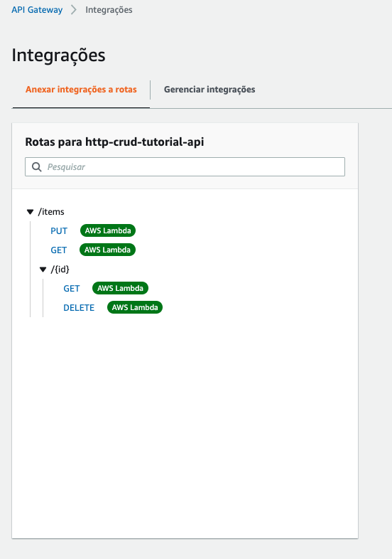

27. Vamos executar os testes da API. Para isso abra o Postman na sua maquina local e clique em `import`. Dentro do selecione a aba `Link`.
    
    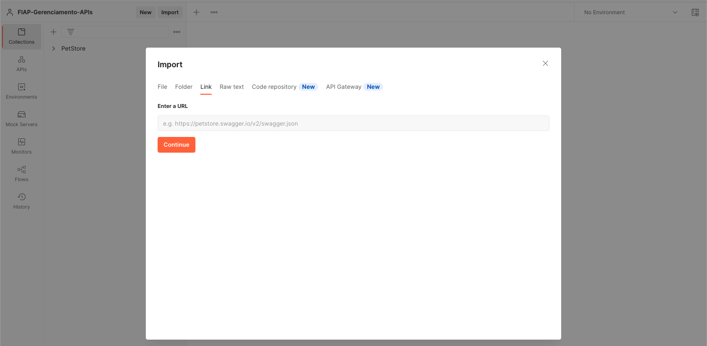

28. No link copie o conteudo abaixo e clique em `continue`:
```url
https://raw.githubusercontent.com/vamperst/fiap-gerenciamento-de-apis/master/02-HTTP-API/http-crud-tutorial-api.postman_collection.json
```
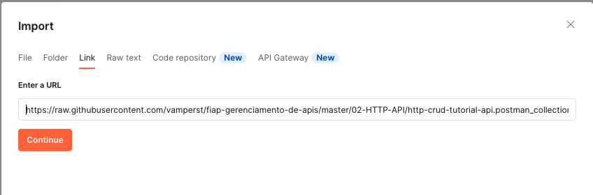

29. Verifique as informações e clique em `Import`
    
    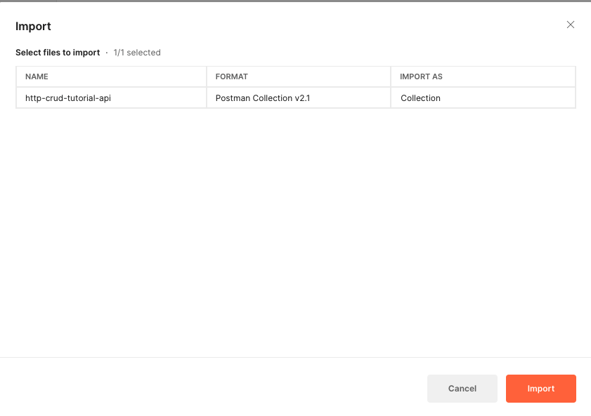

30. Você irá precisar da URL base da sua API. Para isso abra seu painel do [API Gateway](https://us-east-1.console.aws.amazon.com/apigateway/main/apis?region=us-east-1), clique na api `http-crud-tutorial-api` e copie a URL descrita em `Invocar URL`
    
    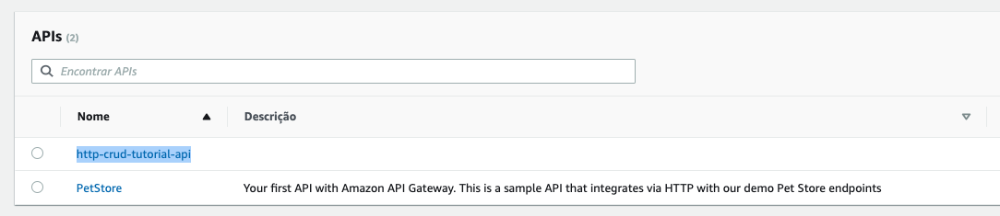

    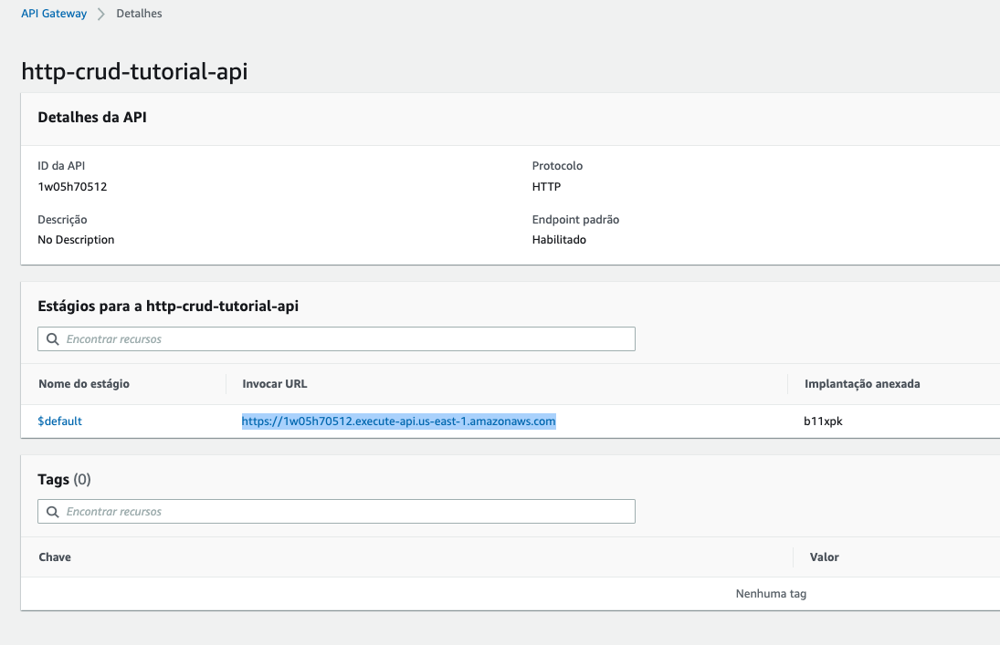

31. De volta ao POSTMAN, clique em `Collections`.
    
    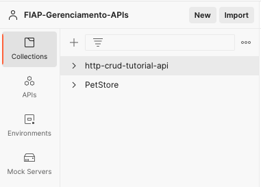

32. Clique em `http-crud-tutorial-api` e selecione a aba `Variables`
    
    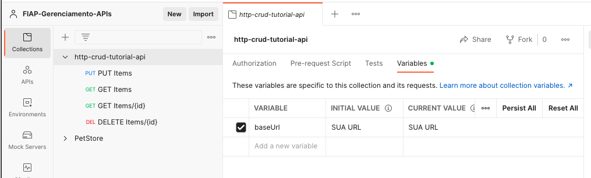

33. Na variavel BaseUrl cole a URL copiada da sua API onde esta escrito `SUA URL` e clique em `Save` no canto superior direito da tela.
    
    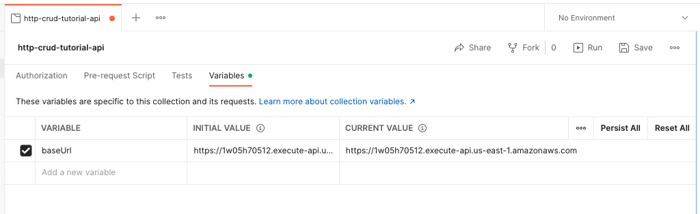

34. A primeira chamada que devemos fazer é para inserir objetos no banco. Para tal abra a chamada `PUT Items` do postman e clique na aba `Body`.
    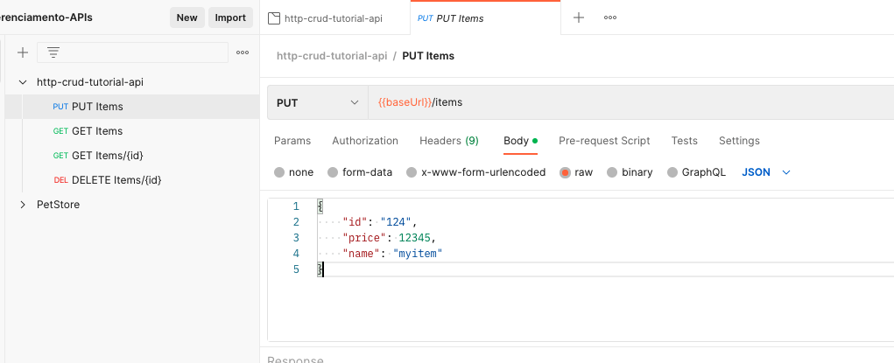
35. Clique em `Send` e se tudo ocorrer bem você verá a mensagem `Put item 124` na parte inferior da página.
36. Altere o valor do id no json 3 vezes com os valores abaixo e clique em `Send` para adicionar mais 3 itens na tabela.
    1. Id: `123`
    2. Id: `125`
    3. Id: `126`

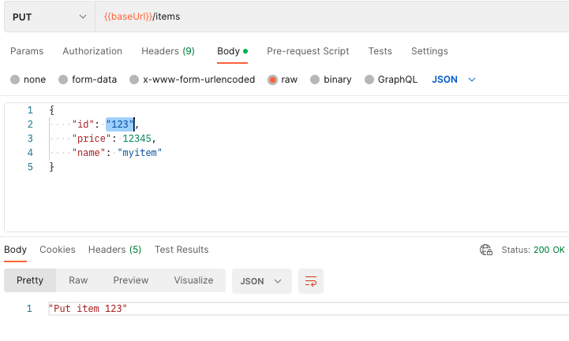

37. Com 4 itens na tabela agora você irá listar esses itens. Clique em `GET Items` e então clique em `Send`. Esse método deve listar todos os objetos inseridos.
    
    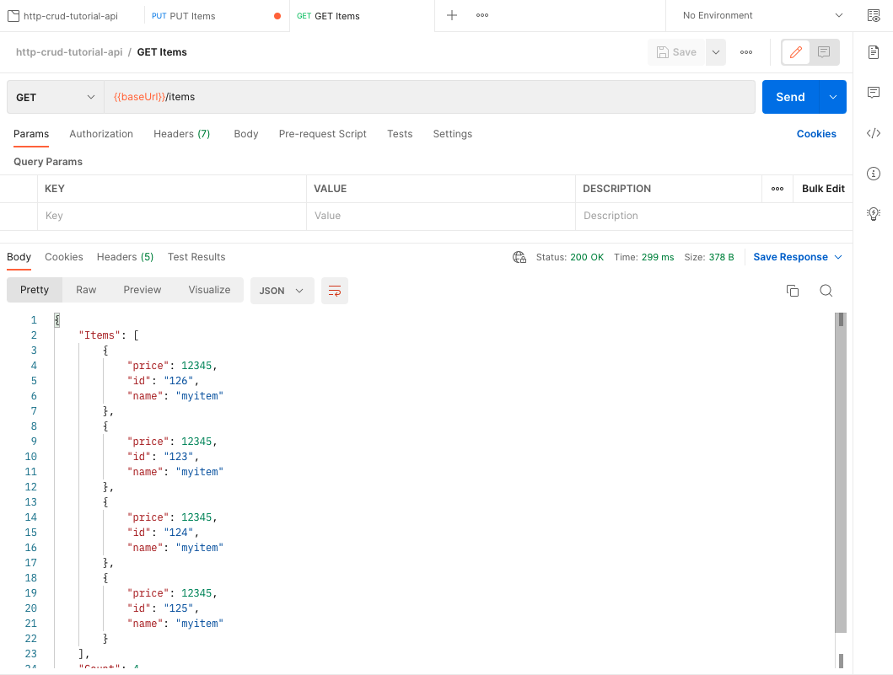

38. Para deletar um item clique em `DELETE Items/{id}`. Como pode ver na URL o item 124 esta descrito. Clique em `Send` para apagar esse item. 
    
    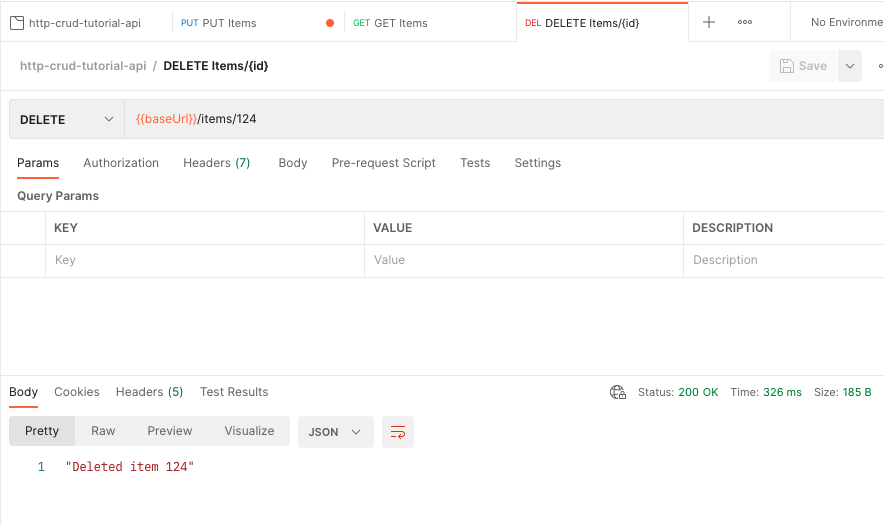

39. Para ver que agora tem apenas 3 items no banco de dados você pode executar a listagem GET novamente.
40. Para visualizar os itens diretamente na tabela do DynamoDB clique no [link](https://us-east-1.console.aws.amazon.com/dynamodbv2/home?region=us-east-1#item-explorer?initialTagKey=&table=http-crud-tutorial-items)

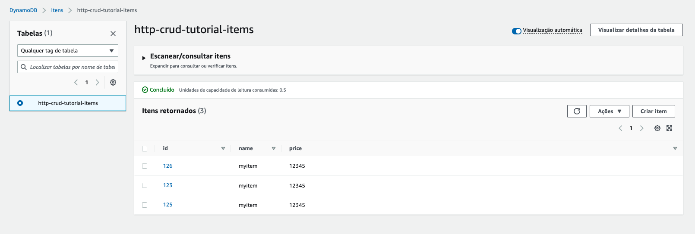
