# 03 - Validação e Autenticação.

Nesse exercicio você irá montar uma arquitetura de RESTFull API com backend em lambda onde as chamadas tem seu formato validado diretamente pelo API Gateway utilizando [Json Schema](https://json-schema.org/) e a autenticação é feita por [chaves de API](https://docs.aws.amazon.com/pt_br/apigateway/latest/developerguide/api-gateway-setup-api-key-with-console.html).

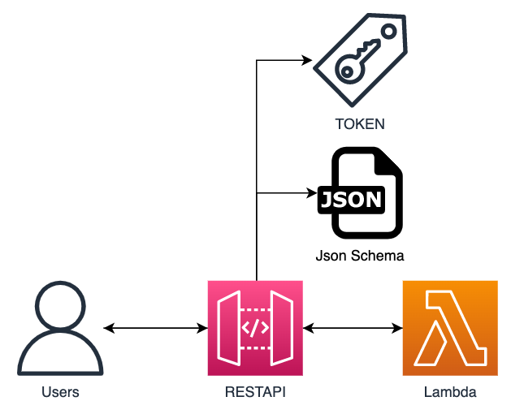


01. Primeiro você vai criar a função lambda que irá receber os eventos da API. Para isso vá para o console do [Lambda](https://us-east-1.console.aws.amazon.com/lambda/home?region=us-east-1#/functions) e clique em `Criar função`.
2.  Preencha os campos com os seguintes valores:
    1. Nome da função: `rest-api-validation`
    2. Tempo de execução: `Python 3.9`
    3. Permissões: `Usar uma função existente`
    4. Função existente: `LabRole`

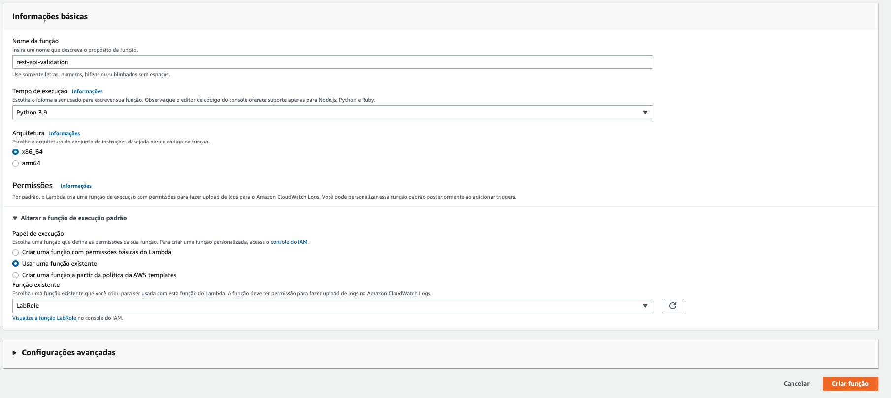

3. Clique em `Criar função` no final da página.
4. No IDE da função copie e cole o código abaixo.
```python
import json

def lambda_handler(event, context):
    
    print(json.dumps(event))
    response = json.loads(event["body"])
    response["Response"]="Validated API"
    
    return {
        'statusCode': 200,
        'body': json.dumps(response)
    }
```


5. Clique em `Deploy` no topo do IDE para atualizar o código da função.
6. Hora de criar a api que irá utilizar esse lambda como backend. Vá para o [painel do api gateway](https://us-east-1.console.aws.amazon.com/apigateway/main/apis?region=us-east-1) e clique em `Criar API` no canto superiror direito.
7. Em `API REST` clique em `compilar`

8. Preencha os campos da seguinte maneira e clique em `Criar API`:
   1. Nome da API: `rest-api-with-validation`
   2. Tipo de endpoint: `Otimizado para fronteiras`

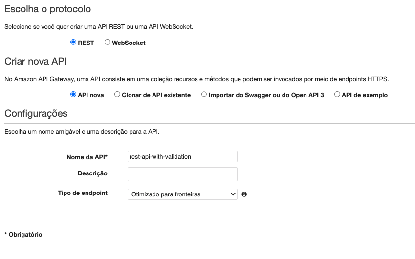

9. Clique em `Ações` e então clique em `Criar recurso` para criar o caminho de usuarios da API.
    
    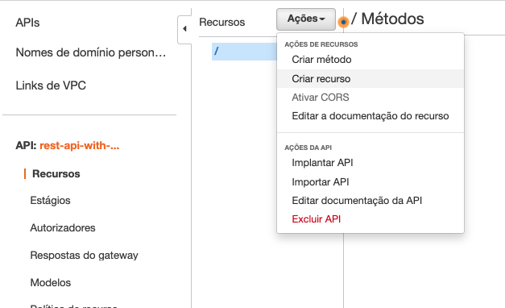

10. Preencha da seguinte maneira e clique em `Criar recurso`.
    1.  Nome do recurso: `user`
    2.  Caminho do recurso: `user`
    3. Ativar CORS do API Gateway: Selecionado

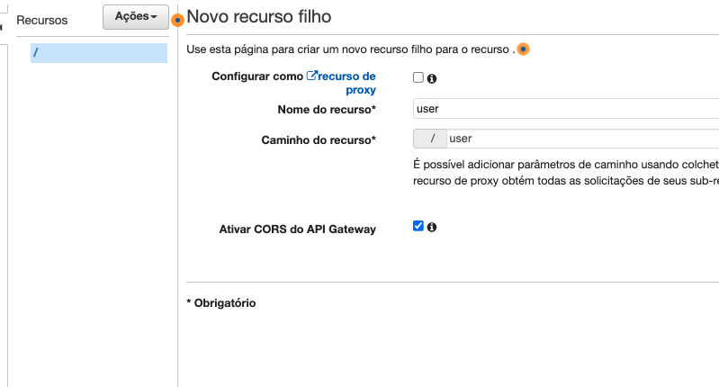

11. De volta ao painel da api com o recurso user récem criado selecionado clique novamente em `Ações` e então clique em `Criar recurso`.

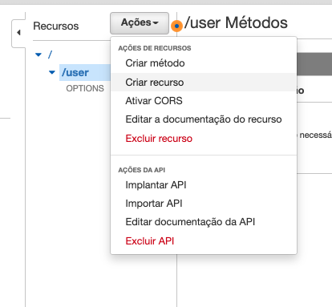

12. Preencha da seguinte maneira e clique em `Criar recurso`.
    1. Nome do recurso: `user creation`
    2. Caminho do recurso: `create`
    3. Ativar CORS do API Gateway: Selecionado
13. Com o recurso create récem criado clique em `Ações` e então clique em `Criar Método`
14. Escolha `POST` na lista proposta.
    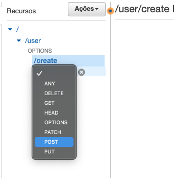
15. Preencha a integração conforme as informações abaixo, clique em `Salvar` e de OK na mensagem:
    1.  Tipo de Integração: `Função Lambda`
    2.  Região do Lambda: `us-east-1`
    3. Função Lambda: `rest-api-validation`
    4. Usar a integração de proxy do Lambda: Selecionado


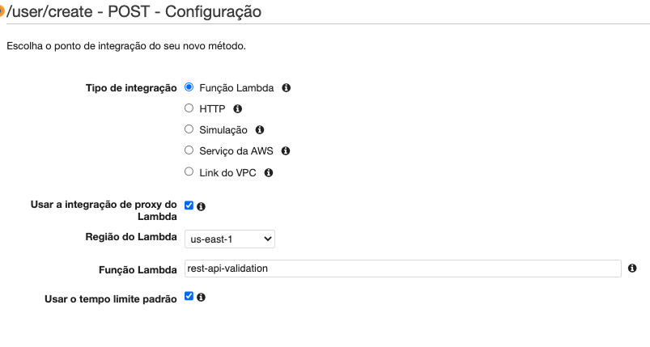


16. Na lateral esquerda clique em `Modelos`.
17. Clique em `Criar`.

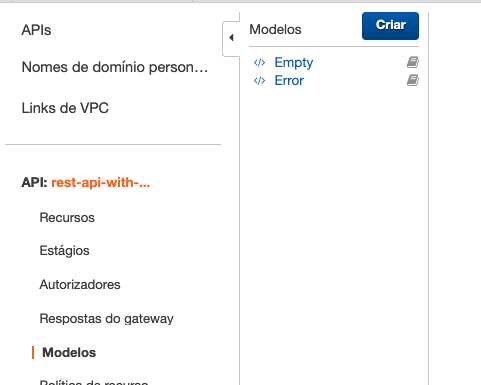

18. Preencha os campos com os seguintes valores:
    1. Nome do modelo: `UserCreateRequest`
    2. Tipo de conteúdo: `application/json`
    3. Esquema do modelo: 
``` json
{
    "title": "Root Schema",
    "type": "object",
    "required": [
        "name",
        "age",
        "dateofregistry"
    ],
    "additionalProperties": false,
    "properties": {
        "name": {
            "title": "The name Schema",
            "type": "string"
        },
        "age": {
            "title": "The age Schema",
            "minimum": 0,
            "maximum": 100,
            "type": "integer"
        },
        "dateofregistry": {
            "title": "The dateofregistry Schema",
            "pattern": "^\\d{4}\\-(0[1-9]|1[012])\\-(0[1-9]|[12][0-9]|3[01])$",
            "type": "string"
        }
    }
}       
```
19. Clique em `Criar Modelo` para salvar o modelo de json schema que irá validar a chamada de criação de usuario da sua API. Esse modelo não permite nenhum campo além dos descritos e todos são obigatórios. Além disso é definido que o campo age pode apenas receber numeros inteiros, dateofregistry tem que receber uma data com o formato YYYY-mm-DD e name tem que ser uma String(texto).
20. Na lateral esquerda clique em `Recursos`
21. Clique no `POST` abaixo do recurso create.
22. Clique em `Solicitação de método`

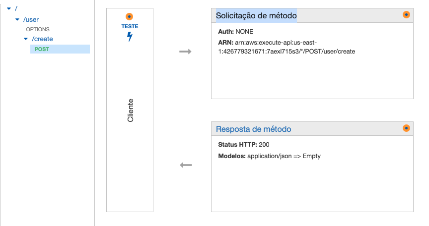

23. Em `Validador de solicitação` escolha a opção `Validar corpo, parâmetros de string de consulta e cabeçalhos` e clique no sinal de check no final da linha.

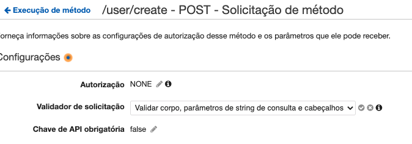

24. Clique em `Corpo de solicitação` e então em `Adicionar modelo`
    
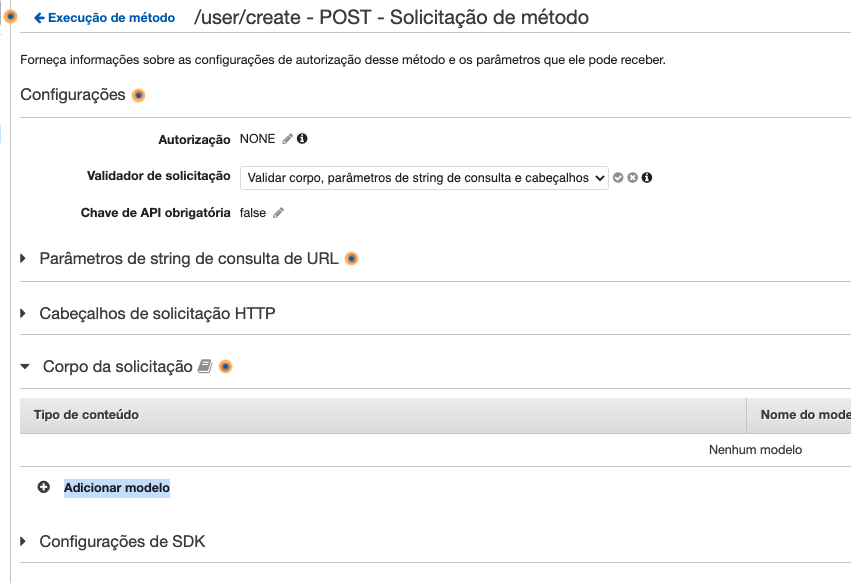

25. Preencha com:
    1. Tipo de conteúdo: `application/json`
    2. Nome do modelo: `UserCreateRequest`
    3. Clique no sinal de check no final da linha para salvar.


26. Para facilitar a vida de quem integra vamos criar um padrão de mensagem de erro para validação de corpo de mensagem onde a causa do erro apareça na resposta. Para tal, clique em `Respostas do gateway` na lateral esquerda do painel do api gateway.
27. Selecione `Corpo de solicitação incorreto`, em modelos de resposta clique em `application/json` e clique em editar.
   
    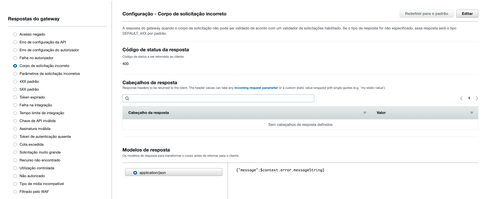

28. Cole no `Corpo do modelo de resposta` o seguinte json:
``` json
{"message": "$context.error.message", "error": "$context.error.validationErrorString"}
```
29. Clique em `Salvar`.

29. Hora de fazer o deploy da sua API. Clique em `Ações` e `Implantar API`
    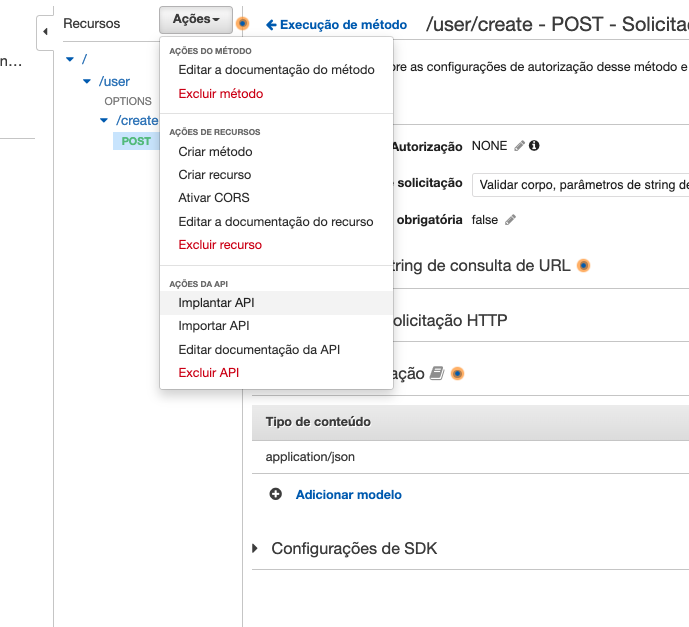

30. Na tela que aparece preencha como descrito:
    1. Estágio de implantação: `[Novo estágio]`
    2. Nome do estágio: `dev`
    3. Clique em `Implante`

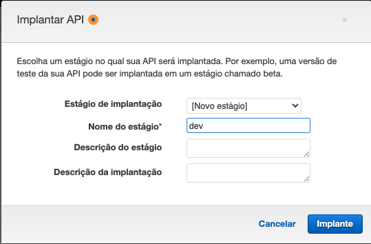

28. Para fazer chamadas de teste clique na aba `Exportar` e clique em `Yaml` em `Exportar como Swagger + extensões do Postman` para baixar um arquivo a ser utilizado no Postman.
    
29. No Postman clique em `Import` e em `Upload Files` selecione o arquivo recem baixado.
    
    

30. Clique em `Import` para finalizar a importação
   
    

31. Na lateral esquerda do Postman clique em `Collections` e expanda `rest-api-with-validation` até conseguir clicar `POST /user/create`


32. Clique em `Send` na lateral direita e verá que a resposta apenas adiciona o campo Response ao objeto enviado. Isso aconteceu pois os campos foram vlaidados e aprovados.
    
    

33. Altere o json que envia retirando o campo age e clique em `Send` para ver o comportamento de resposta da API.
    
    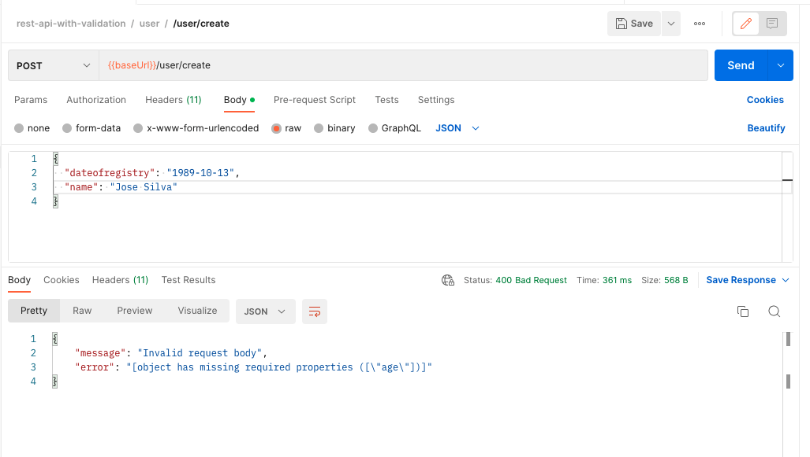

34. Faça testes com outros campos e formatos de envios para ver o comportamento das validações. Como por exemplo tentar colocar um mês com número acima de 12.
35. Devolta ao painel da sua récem criada api no API Gateway no navegador, clique em `Chaves de API`.
36. Clique em `Açoes` e `Criar chave de API`
    
    

37. Preencha o campo nome com `fiap-api` e clique em `Salvar`
    
    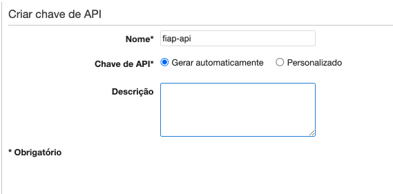

38. Clique em 'mostrar' e copie o texto da chave de API para uso nos próximos passos


39. Na lateral esquerda clique em `Recursos` para voltar e editar os recursos da api rest-api-with-validation para que aceitem apenas chamadas com a chave inclusa.
40. Clique em `POST`, o método criado para o recurso create da API.
    
    
    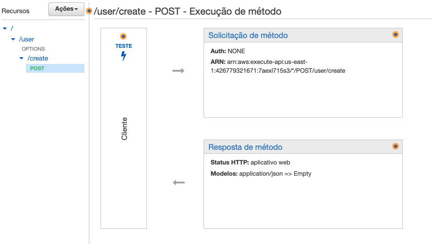

41. Clique em `Solicitação de método` para editar a necessidade de chaves.
42. Edite o campo `Chave de API obrigatória` para ficar com o valor `true` e salve o check do final da linha.

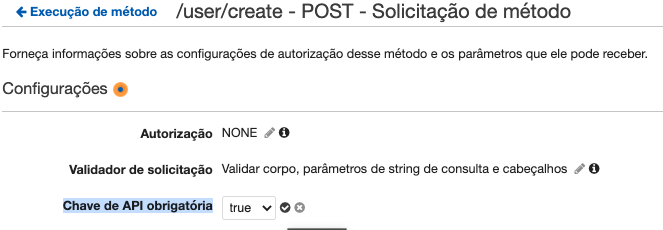

43. Faça a implantação da API para fazer valer a alteração. Clique em ações e então `Implantar API`. Selecione o estágio `dev` e clique em `Implante`.

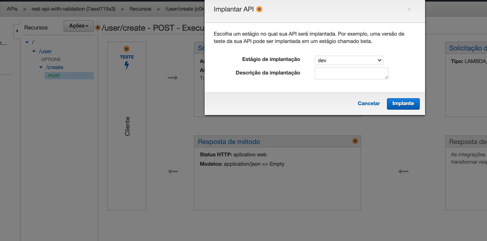

44. Agora é hora de criar o plano de uso da API e adicionar a chave recem criada como permitida. Para iniciar o processo, na lateral esquerda clique em `Planos de uso`.
45. Clique em `Criar`
    
    

46. Preencha os campos conforme a descrição e clique em próximo:
    1. Nome: `api-validation-plan`
    2. Taxa: `1000`
    3. Pico: `1500`
    4. Requisições por mês: `100000`


47. Clique em `Adicionar estágio de API`
48. Preencha segundo a descrição:
    1.  API: `rest-api-with-validation`
    2.  Estágio: `dev`
49. Clique no check no final da linha
    
    

50. Clique em `Configurar limitação de método` e em seguida clique em `Adicionar recurso/método`.
51. Preencha segundo a descrição:
    1.  Recurso: `*`
    2.  Método: `*`
    3. Taxa: `1000`
    4. Pico: `1500`


52. Clique no check no final da linha e após em `Fechar`
    
    

53. Valide que sua página de `Estagios de API associados` esta como na imagem e clique em próximo.


54. Clique em `Adicionar chave de API ao plano de uso`
55. Digite `fiap-api` na pesquisa e selecione a chave recem criada.


56. Clique em `Concluído`.
57. Agora vá até o Postman para testar. Na lateral esquerda clique em `Collections` e expanda `rest-api-with-validation` para clicar em `POST /user/create`
    
    

58. Clique em `Send` na lateral direita superior para ver que não consegue mais fazer a chamada sem autorização.

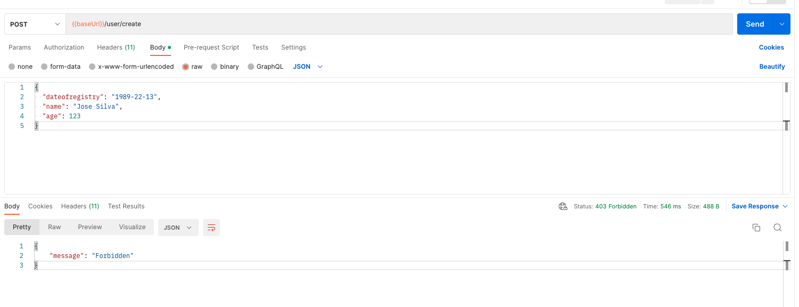

59. No Postman, dentro do método `/user/create` clique na aba `Headers`
60. Adicione a Key `x-api-key` com o valor da chave que copiou no passo 42. Caso tenha perdido, acesse o [link](https://us-east-1.console.aws.amazon.com/apigateway/home?region=us-east-1#/api-keys), clique em fiap-api e mostrar.
    
    

61. Clique em `Save` na lateral direita superior do Postman.
62. Clique em `Send` na lateral direita superior e note que a chamada foi bem sucedida por que adicionou o API Key.