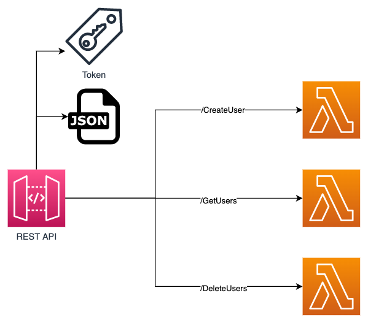
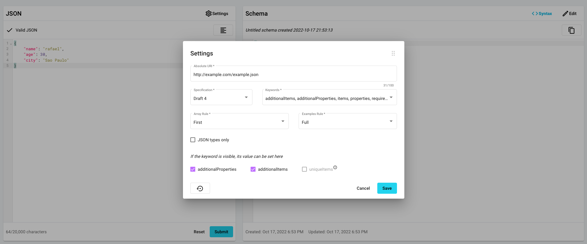

# Trabalho Final




Em grupos de até 6 você irá desenvolver uma API REST:
- Validação de chamada por token
- Validação de todos os Endpoints com Json Schema não permitindo erros de tipo do atributo. inserção de novos atributos e todos os atributos abaixo são obrigatórios
- 3 Endpoints POST com backend lambda

Os endpoints devem receber os seguintes payloads de chamada:

##### /CreateUser

```json
{
    "name":"rafael",
    "age": 30,
    "city": "Sao Paulo"
}
```

##### /GetUsers

```json
    {
        "ageGreaterThen": 25,
        "ageLessThen": 32
    }
```

##### /DeleteUsers

```json
    {
        "age": 30,
        "city": "Sao Paulo"
    }
```


Para converter os jsons em json schema você pode utilizar o site [jsonschema.net](https://www.jsonschema.net/app/schemas/0)(É necessário criar uma conta de forma gratuita). Utilize a configuração abaixo para facilitar:


Lembrando que o campo `"additionalProperties"` tem que ficar `false` para que a API não aceite campos fora do schema.

Para facilitar o backend, podem utilizar o mesmo código em todos os lambdas. Reutilize o código Python contido no execício [03 - Validação e Autenticação](https://github.com/vamperst/fiap-gerenciamento-de-apis/tree/master/03-Validacao-Autenticacao).

### Entregavel

Você deve subir um zip no portal contendo:

- Arquivo de POSTMAN para chamar sua API
- Os 3 arquivos json schema dos endpoints
- Prints de todas as telas de configuração do API Gateway dos 3 métodos criados


### Lembrete

Não delete a API criada, ela será acessada no momento de corrigir o trabalho.